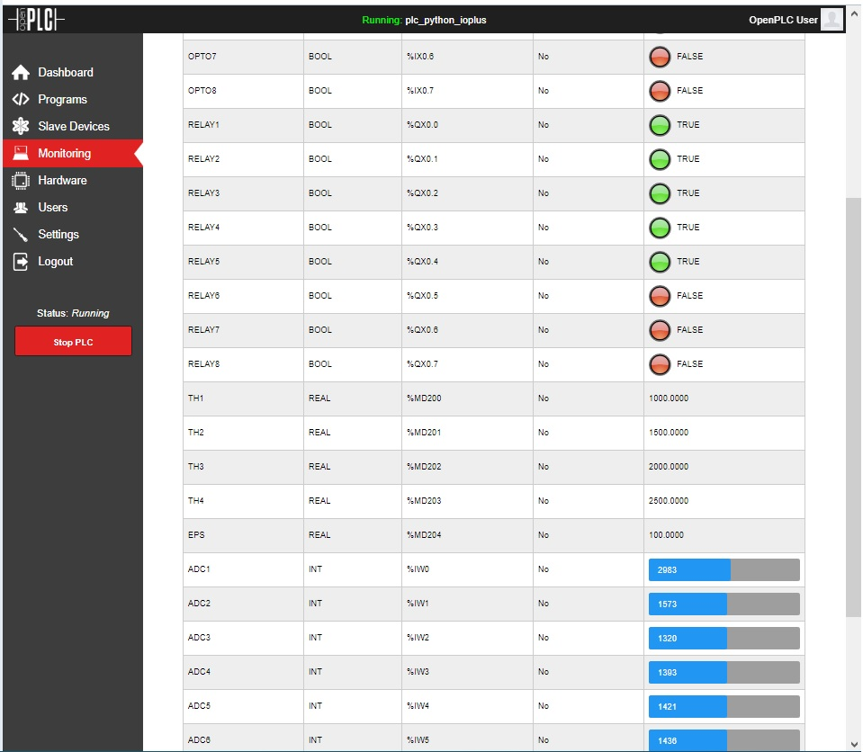

[](https://www.sequentmicrosystems.com)

# OpenPLC guide for Home Automation Card for Raspberry Pi

The OpenPLC team recently developed a new hardware layer called Python SubModule or just simply PSM. The description is this:
_"PSM is a powerful bridge that connects OpenPLC core to Python. You can use PSM to write your own OpenPLC driver in pure Python."_

We start to test this new cool feature and we share with you the setup process:
1) You need to install ioplus python library for python3 since PSM use python3
```bash
~$ sudo apt-get update
~$ sudo apt-get install build-essential python3-pip python3-dev python3-smbus git
~$ git clone https://github.com/SequentMicrosystems/ioplus-rpi.git
~$ cd ioplus-rpi/python/ioplus/
~/ioplus-rpi/python/ioplus$ sudo python3 setup.py install
```
2) Install OpenPLC on Raspberry, instructions [here](https://www.openplcproject.com/runtime/raspberry-pi/)
3) In the  OpenPLC web server go to the Hardware tab and select _Python on Linux (PSM)_.
You will see a text editor with some python code written in it, here some things to do for controlling the Home Automation Card:
- Import the library:
```python
import libioplus
```

 - Read some inputs in _update_inputs()_ funtion. We read all the 8 optocoupled digital inputs and all 8 analog inputs and update PLC variables:
 ```python
 def update_inputs():
    #Read optocoupled inputs
    val = libioplus.getOpto(0)
    for i in range(8):
        var_state = False
        if val & (1 << i) != 0:
            var_state = True
        psm.set_var("IX0." + str(i), var_state)#move OPTO state to IX0.0 .. IX0.7
    for i in range(8):
        valAdc = libioplus.getAdcV(0, i+1)
        psm.set_var("IW" + str(i), int(1000 * valAdc)) #Update adc in value (mV) IW0 .. IW7 
 ```
 
 - Write some outputs on _update_outputs()_ function. Relays from variables _QX0.0 .. QX0.7_ and DAC channels from _QW0 .. QW3_ :
 ```python
 def update_outputs():
    val = 0
    for i in range(8):
        a = psm.get_var("QX0." + str(i))
        if a == True:
            val+= 1 << i
    libioplus.setRelays(0, val)
    for i in range(4):
        val = psm.get_var("QW" + str(i))# DAC value in mV
        if val < 0:
            val = 0
        if val > 10000:
            val = 10000
        libioplus.setDacV(0, i+1, val/1000.0)
 ```
In the main loop, the only thing you might want to do is to adjust the PSM cycle time.
Now you can access relays, optocoupled digital inputs, the voltage in and voltage outputs thru PLC variables, below you see screen capture with monitoring our variables:


