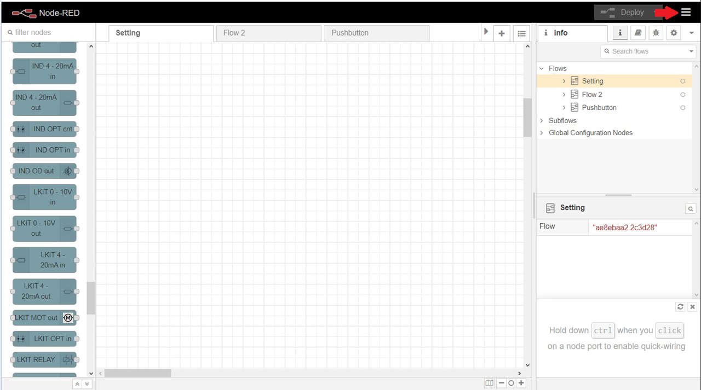
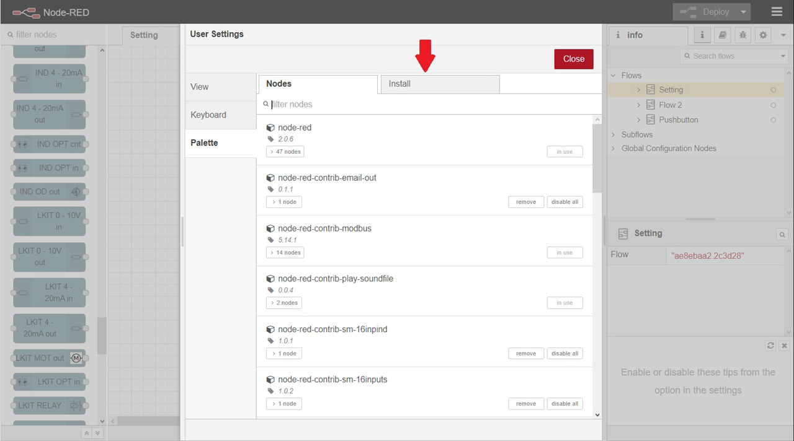
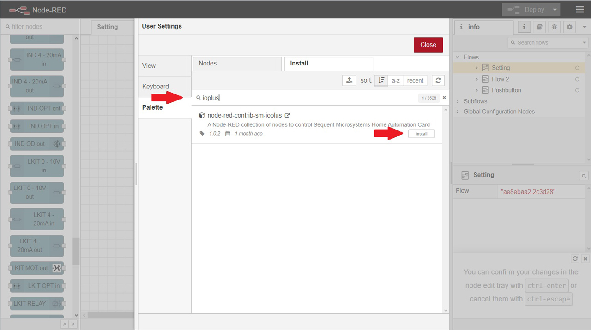

# node-red-contrib-sm-ioplus

The Node-RED nodes for the <a href="https://sequentmicrosystems.com/products/raspberry-pi-home-automation-card" target="_blank" rel="noopener">Home Automation card</a>

## Command line installation

For first time installation, clone the repository:
```bash
~$ git clone https://github.com/SequentMicrosystems/ioplus-rpi.git
```

If you already cloned the repository, update to the latest version:
```bash
$ cd /ioplus-rpi/  
~/ioplus-rpi$ git pull
```
Install the Node-RED nodes:
```bash
$ cd /.node-red
/.node-red$ npm install /ioplus-rpi/node-red-contrib-sm-ioplus
```
Restart the Node-RED service
```bash
~$ node-red-stop
~$ node-red-start
```

## Node-RED installation

On the Node-RED home screen click on the Menu icon on the top toolbar right corner:


then "Manage Palette":


then "Install" tab:


Search for "ioplus" and click "Install" again:


Sequent Microsystems nodes for the Home Automation card will be displayed on the Node-RED palette

## Usage


### IOPLUS RELAY

This node control relays of the card, one relay if you set "relay" parameter in range [1..8] and all if you set "relay" to 0.
The card stack level and channel number can be set in the node dialog box or dynamically through ```msg.stack``` and ```msg.channel```.
The payload of the input message contain the state of one relay or a 8 bits number with the state of all 8 relays.

### IOPLUS 0 10V out

This node controls one 0-10V output channel.
The card stack level and channel number can be set in the node dialog box or dynamically through ```msg.stack``` and ```msg.channel```.
The value in volts is set dynamically as a number between 0..10 thru ```msg.payload```.

### IOPLUS ADC in

This node reads one analog input channel. 
The card stack level and channel number can be set in the node dialog box or dynamically through ```msg.stack``` and ```msg.channel```.
The read is triggered by the message input and output can be found in the output message payload as a number representing the voltage.

### IOPLUS OPT cnt

This node reads the optically coupled input cunter for one particular channel and sets the counting edges for that channel.
Card stack level and optically coupled input counter channel number can be set in the node dialog box or dynamically through ```msg.stack``` and ```msg.channel```.
Rising edge counting and/or falling edge counting can be enabled/diabled with corresponding check box in the node dialog.
Edge settings are sent to the card every time you deploy this node or the flow starts or you select a different channel for reading through ```msg.channel```.
The read is triggered by the message input and output can be found in the output message payload.

### IOPLUS OPT in

This node reads the optically coupled input state for one particular channel.
Card stack level and optically coupled input channel number can be set in the node dialog box or dynamically through ```msg.stack``` and ```msg.channel```.
The read is triggered by the message input and output can be found in the output message payload as boolean.

### IOPLUS OD out

This node controls one Open-Drain output channel.
Card stack level and channel number can be set in the node dialog box or dynamically through ```msg.stack``` and ```msg.channel```.
The value in percentage is set dynamically as a number between 0..100 thru ```msg.payload```.

## Important note

This node is using the I2C-bus package from @fivdi, you can visit his work on github [here](https://github.com/fivdi/i2c-bus). 
The inspiration for this node came from @nielsnl68 work with [node-red-contrib-i2c](https://github.com/nielsnl68/node-red-contrib-i2c).
We thank them for the great job.
